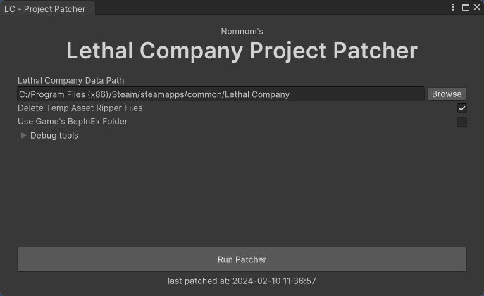

# USE THE REWRITTEN TOOL HERE INSTEAD: https://github.com/nomnomab/unity-lc-project-patcher
 
# Lethal Company Project Patcher

> This tool is still in development and is quite experimental, but should be usable.
> 
> Before patching, **back up your project first**!

This tool fills in a unity project with functional assets so you can run the game in the editor to test custom plugins.

This tool does **not** distribute game files. It uses what is already on your computer from the installed game.

## What does it do?

- Installs required packages, and enforces specific versions for them
- Updates various project settings:
  - Tags
  - Layers
  - Physics settings
  - Time settings
  - Navmesh settings
- Strips generated netcode inside of game scripts so they can compile in Unity
- Fixes missing script references
- Fixes missing shaders on materials
- Fixes broken scriptable objects
- Copies needed DLLs from the game directly
- Exports game assets with an embeded version of Asset Ripper
- Sets up a BepInEx environment to test patches and plugins in-editor
- Can load up normal plugins in-editor
- And much more!

[//]: # (- Supports disabling domain reloading in-editor for faster compile times)

## Requirements

- About 900 MB for the asset ripper export
  - There is a toggle to delete the export after the patcher is done
- About 900 MB for the copied files from that export into the project
- [Git](https://git-scm.com/download/win)
- [Unity 2022.3.9f1](https://unity.com/releases/editor/archive)
- [.NET 8.0](https://dotnet.microsoft.com/en-us/download/dotnet/8.0)
  - For running Asset Ripper
- [FFmpeg (Optional)](https://ffmpeg.org/)
  - To re-encode videos for Linux support
- If using DunGen, then at least version `2.15.1`

## Installation
#### Using Unity Package Manager

1. Make sure you have git installed: https://git-scm.com/download/win
    - After installing, restart Unity
2. Open the Package Manager from `Window > Package Manager`
3. Click the '+' button in the top-left of the window
4. Click 'Add package from git URL'
5. Provide the URL of the this git repository: https://github.com/nomnomab/lc-project-patcher.git
    - If you are using a specific version, you can append it to the end of the git URL, such as `#v0.3.0`
6. Click the 'add' button

> If you are using version `0.3` then you need to remove the `Assets\LethalCompany\Tools\Plugins\BepInEx\Utility` folder, 
> as it is in the package itself now.

## Usage

1. Make sure you have all requirements installed!
2. Create a new Unity project
    - Use version [2022.3.9f1](https://unity.com/releases/editor/archive)
    - Use the 3D (HDRP) template
3. Open the tool from `Tools > Nomnom > LC - Project Patcher > Open`
    - This will create some default folders for you when it opens

> At this point if you have the DunGen asset, or any other asset store asset, import it now and move it into `Assets\Unity\AssetStore`. 
> This is the location the patcher checks for existing assets if needed.
> 
> If you don't put DunGen in that location, it will not exclude the guids from the asset ripper export and things will explode :)

4. Assign the Game's data directory path at the top
    - Example being `C:\Program Files (x86)\Steam\steamapps\common\Lethal Company\Lethal Company_Data`
5. **Back up your project** if you already have a patched project at this point
6. Click the `Run Patcher` button
    - This process *will* take a while, so be patient
    - The editor may restart a few times, this is normal
    - When it asks about the New Input System and switching backends, click `Yes`
    - If this is ran *after* already patching it will attempt to re-patch the project.
      - **Back up your project before doing this** otherwise you risk corrupting your project guids.
      - The re-patching process will take *considerably* longer than the initial patch, as it has a lot more guids to sort through.
      - When migrating between game versions some things may not properly convert over, such as models or prefabs that were modified. So you may have to do some manual adjustments depending on severity.
7. Now you should have a nice template to work from!

## After Usage

### DunGen

> The version I test with is version `2.15.1`

If you have an older version of DunGen and you get some errors related to the NavMeshAdapter, then do the following:

- Put `using Unity.AI.Navigation.Editor;` at the top of `DunGen/Integration/Unity NavMesh/Editor/UnityNavMeshAdapterInspector.cs`
- Put `using Unity.AI.Navigation;` at the top of `DunGen/Integration/Unity NavMesh/UnityNavMeshAdapter.cs`

### BepInEx

You can make plugins directly in the editor like normal.

> I have not tested *patchers*, so use them with caution!

If you want to add some normal plugins, you'll have to navigate outside of `Assets` for this, and next to it is a folder called `Lethal Company`.

This is a dummy folder that houses the normal BepInEx root and a fake game data structure so it can initialize before I route it to the actual game files.

### Notes

There are some settings you can change in the `LCPatcherRuntimeSettings` asset in the project (generally at the root of your project).

- You can also open it at any time from the menu item `Tools > Nomnom > LC - Project Patcher > Open Runtime Settings`

In there you can change things like experimental settings, skips if available, bepinex settings, and more.

## Project Structure

- `[ProjectName]\Assets\LethalCompany\Game` - The ripped game assets in an easier to navigate folder structure
- `[ProjectName]\Assets\LethalCompany\Mods` - A common folder to place custom plugins or plugins you want to reference
- `[ProjectName]\Assets\LethalCompany\Tools` - BepInEx, MonoMod, and any other "core" dll goes here
- `[ProjectName]\Assets\Unity\AssetStore` - Where assets from the asset store should go to keep them nice and tidy
  - Also where the tool picks up DunGen from to use for guids instead of the one provided by the game
  - This folder gets re-imported when the tool runs to fix any weird asset issues 
- `[ProjectName]\Assets\Unity\Native` - The default files/folders that were in the `Assets` root when running the tool
- `[ProjectName]\Lethal Company\BepInEx` - The normal BepInEx directory people are used to
- `[ProjectName]\*.cfg` - Where the editor version of BepInEx places config files

## FAQ

### Can I use my normal BepInEx folder in the game directory?

Yep! Just turn on the option located in the LCPatcherRuntimeSettings asset in the root of your project 
(if it isn't there, open the tool to generate it, or create a new one manually).

Afterward, you should restart Unity if you already have some plugins loaded up to unload them.

### Can I transfer assets from another project into this after patching?

Yes, but you'll have to do it manually.

1. Temporarily install this tool in your original project (it won't affect it)
   - Otherwise copy the [ExtractProjectInformationUtility.cs](https://github.com/nomnomab/lc-project-patcher/blob/master/Editor/ExtractProjectInformationUtility.cs) script into your original project in case that doesn't work
2. Run the type extractor from `Tools > Nomnom > LC - Project Patcher > Extract Project Information`
3. Once this is done, it will make a json file with the required information at the location you specified
4. Go back to the new project
5. Copy over any assets from the old project to the new project
6. Run the asset patcher from `Tools > Nomnom > LC - Project Patcher > Patch Assets From Other Projects...`
7. Select the json file you made from the other project
8. Wait for the patcher to complete
9. Now your assets *should* be migrated over properly
   - Some things may still require manual migration, as this process isn't perfect!

If there are any "missing prefab" issues in your prefabs/scenes, then make sure you have the needed assets in the project.

This does not migrate materials, audio clips, meshes, etc to the ones in the new project, so those will have to be manually fixed if needed.

### How can I build my plugin?

This is a tricky question.

Due to how Unity handles its Assembly-CSharp dll, you can't use asmdefs in project *and* reference game code. If it supported this, we could build plugins with only in-editor scripts easily.

However, if you wanted to build asset bundles with proper script references and such, you'll have to use a regular .NET project. Here are some example steps:

1. Make a regular .NET project. Such as using a plugin template, or a bepinex template.
2. Build the plugin so you get a dll to use.
3. Put the dll and any additional dependencies into the unity project under `Assets\LethalCompany\Mods\[Your Mod's Name]`
    - Most plugin dependency dlls are already set up in the project for you
4. Now you can use the plugin in the editor, make asset bundles with components from the plugin, and test in-editor

To make step 3 simpler, you can set up a post-build step that copies the built plugin into the project for you.

### Why can I not delete a plugin from the plugins folder?

If a plugin is loaded while playing the game in-editor, then it will stay loaded forever. This is just how Unity handles their dll hooks.

If you need to remove a plugin, then close unity first, then delete it.

The same steps go for anything else that BepInEx has a hook on, such as its log files.

### Why is my audio doubling?

For some reason the diagetic audio mixer's master group has effects on by default. The main reason why there is an echo
is due to the `Echo` effect on it. 

If the auto-patcher didn't work, you can remove this effect by:

1. Opening the `Diagetic` audio mixer
2. Clicking on the `Master` group
3. Going into the inspector and navigate to where `Echo` is
4. Click the gear in the top-right of the effect and click `Bypass`
5. Profit

[//]: # (### How can I make Unity not take three years to compile scripts when pressing play?)

[//]: # ()
[//]: # (> Make sure you understand what you have to do manually if domain reloading is disabled)

[//]: # (> )

[//]: # (> https://docs.unity3d.com/Manual/DomainReloading.html)

[//]: # ()
[//]: # (This is straightforward, as long as your own plugin code supports it.)

[//]: # ()
[//]: # (Not all plugins support this by the way, so expect errors with ones that don't handle static values properly.)

[//]: # ()
[//]: # (1. Open the `Edit > Project Settings` menu)

[//]: # (2. Go to the `Editor` tab)

[//]: # (3. Check `Enter Play Mode Options`)

[//]: # (4. Check `Reload Scene`)

[//]: # ()
[//]: # (Now it will take like a second to press play instead of a minute 😀)

### How can I add MMHOOK_Assembly-CSharp.dll

For now get it normally via the normal game and the patcher approach. Once you have the dll, put it into the plugins directory.

- The default location is `[ProjectName]\Lethal Company\BepInEx\plugins`

### Where did support go for disabling domain reloading?

Some mods don't support domain reloading, and sometimes even when disposing everything manually they can still cause issues.

So for now I'm not supporting it. Use it with cation if you use it anyway!

### How can I split the combined meshes that I can find in scenes?

There are a few ways to do this:

1. Select a combined mesh in the Project window, right click it, and select `Split Combined Meshes in Scenes` near the bottom
    - This will split the mesh for all objects in all game scenes that use it
2. Select an object in scene that has a combined mesh, right click its MeshFilter, and select `Split Combined Mesh` near the bottom
    - This will only split the mesh for that object
3. Select an object in scene that has a combined mesh, right click its MeshFilter, and select `Split Combined Mesh in Scene` near the bottom
    - This will split the mesh for all objects in the current scene that use it

For meshes that have a material with pixel displacement, their uvs will tend to warp and distort. This is being looked at.

## Useful packages

- Parrel Sync - https://github.com/VeriorPies/ParrelSync.git?path=/ParrelSync
  - This lets you run multiple instances of the project at once to test LAN without building the game.

- Editor Attributes - https://github.com/v0lt13/EditorAttributes.git
  - This is a nice package that adds some useful attributes for the inspector

## Credits

- Asset Ripper - https://github.com/AssetRipper/AssetRipper
  - Modified source - https://github.com/nomnomab/AssetRipper
- Asset Bundles Browser - https://github.com/Unity-Technologies/AssetBundles-Browser
- UniTask - https://github.com/Cysharp/UniTask
- UYAML Parser - https://gist.github.com/Lachee/5f80fb5cb2be99dad9fc1ae5915d8263
- MonoMod - https://github.com/MonoMod/MonoMod
- GameViewSizeShortcut - https://gist.github.com/wappenull/668a492c80f7b7fda0f7c7f42b3ae0b0
- BepInEx - https://github.com/BepInEx/BepInEx
- Newtonsoft Json.NET - https://www.newtonsoft.com/json
- IntegrityChaos - for the posterization shader remake
- Rune - for the Linux support

 

