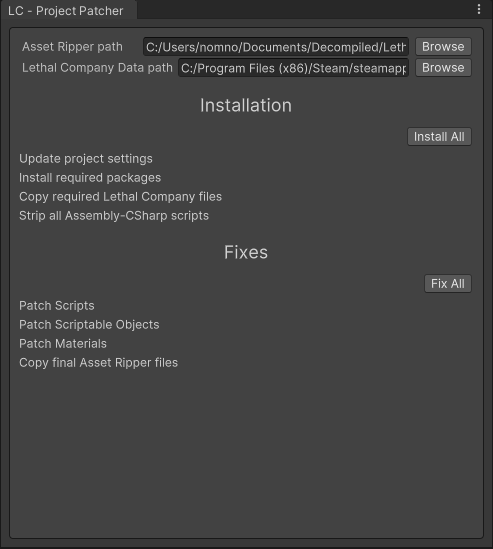

# Lethal Company Project Patcher

> This tool is still in development and is quite experimental, but should be usable.

This tool fills in a unity project with functional assets so it can be used for Lethal Company modding.

## What does it do?

- Installs required packages, and enforces specific versions for them
- Updates various project settings:
  - Tags
  - Layers
  - Physics settings
  - Time settings
  - Navmesh settings
- Strips game scripts so they can compile in Unity
- Fixes missing script references
- Fixes missing shaders on materials
- Fixes broken Scriptable Objects
- Copies needed DLLs from the game directly
- Copies needed files from the Asset Ripper exported project

## Installation
#### Using Unity Package Manager
1. Open the Package Manager from `Window/Package Manager`
2. Click the '+' button in the top-left of the window
3. Click 'Add package from git URL'
4. Provide the URL of the UniTask git repository: https://github.com/Cysharp/UniTask.git?path=src/UniTask/Assets/Plugins/UniTask
6. Click the 'add' button
7. Repeat the same steps to install this git repo as a package: https://github.com/nomnomab/lc-project-patcher.git

## Usage

[//]: # (> Once you start the steps, do them all as different steps will modify the Asset Ripper exported project.)

[//]: # (> )

[//]: # (> So things could get weird if you don't start fresh each time.)

1. Create a new Unity project
    - Use version 2022.3.9f1
    - Use the 3D (HDRP) template
2. Use AssetRipper to export the game files
   - Set Script Export Format to `Decompiled`
   - Set Script Content Level to `Level 1`

> At this point if you have the DunGen asset, you can import it into the project to use it for DunGen-related guids.
> Make sure it is in its default location. 
> 
> Importing DunGen *after* the tool runs may cause serialization issues.

3. Open the tool from `Tools/Nomnom/LC - Project Patcher`
4. Assign the Asset Ripper export directory path at the top
   - Example being `[some path]\Lethal Company\ExportedProject`
   - Do not include `Assets` at the end
5. Assign the Game's data directory path at the top
    - Example being `C:\Program Files (x86)\Steam\steamapps\common\Lethal Company\Lethal Company_Data`
6. Click `Install All` to run the install stage
   - This will restart Unity when it finishes to apply packages and enforce the New Input System
   - When it asks about switching the new backend to the New Input System, press Yes
7. Click `Fix All` to run the fix stage once you are back in the project
    - This will patch scripts, materials, etc
    - This will also copy the finished files into the project
    - This will probably take a while
8. Now you should have a nice template to work from!

## Notes

- If you have DunGen in the project (in the default location) then it will use that for any DunGen-related guids instead of the stubs
  - Make sure DunGen is in the project *before* using the tool

## Credits

- Asset Bundles Browser - https://github.com/Unity-Technologies/AssetBundles-Browser